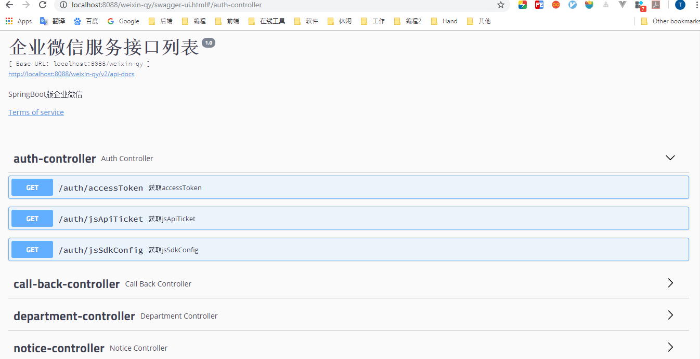
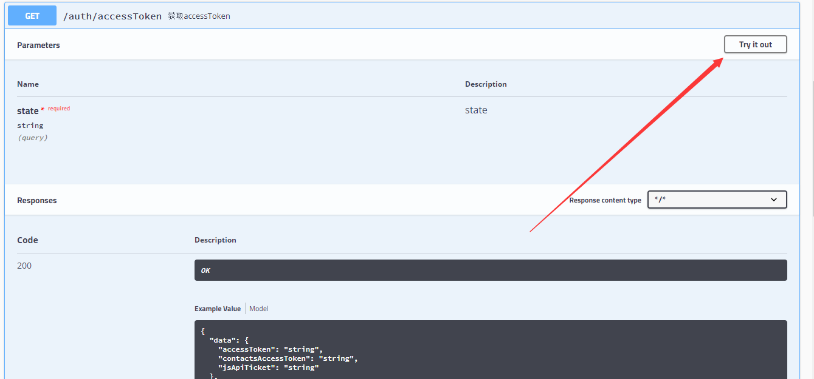
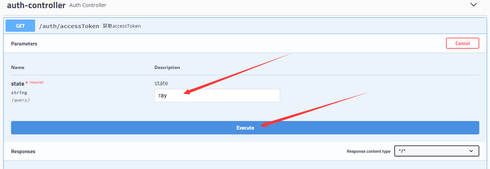
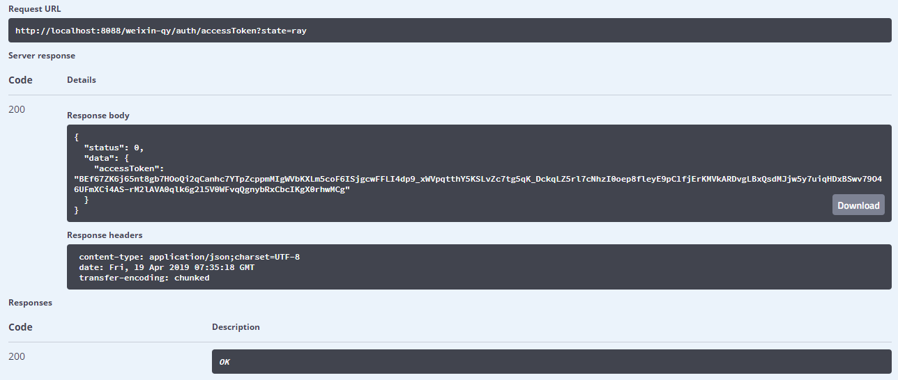

[TOC]


# weixin-service

使用 springboot 打通企业微信相关接口 

是系列博客 [Java企业微信开发](https://www.cnblogs.com/shirui/category/1053578.html) 的升级版


# 一、项目启动

## 1.获取项目源码

```bash
git clone git@github.com:shirayner/weixin-service.git
```


## 2.启动项目

进入 `weixin-qy` 目录，然后执行 `gradlew bootRun`命令，即可启动项目。


## 3.API列表

项目启动成功后访问如下地址，可进入 API 列表页面，如下图所示：

> http://localhost:8088/weixin-qy/swagger-ui.html





## 4.测试接口

以获取`accessToken`接口为例

（1）点击 `try it out`




（2）输入`state`参数，此参数是为了区分多个企业微信应用而设置的，可在配置文件中配置：

```yml
weixin:
    qy:
       corpId: ww92f5da92bb24696e
       contactsSecret: 1m_9XP62YrXjSiYtL5Thba7DRUarqaExKfr_5eAL09w
       agent:
        - agentId: 1000002
          agentSecret: I73733veH3uCs6H_ijPvIjYD4Rese5UlbYhhQOEE1-I
          token: ray
          encodingAesKey: z2W9lyOAR1XjY8mopEmiSqib0TlBZzCFiCLp6IdS2Iv
          state: ray
        - agentId: 1000003
          agentSecret: gcGhoOnBWOsyN0mz1TrcUQmO7X71YSv4Ma_TW0F9ilM
          token: weixin
          encodingAesKey: YVbcm1g1ynErRKLeugtsr88VlK7ukpkPZHQJICz6SFQ
          state: hecGroup
```


如下图，若要获取企业微信应用ID为 `1000002`的应用的 accesstoken, 则可state 值输入 ray,然后点击excute即可请求对应接口，并获取accessToken.




（3）最后的接口响应结果如下：




# 附录

1. [Gradle 学习总结](https://github.com/shirayner/java-knowledge-hierarchy/tree/master/doc/gradle)
2. [Java企业微信开发](https://www.cnblogs.com/shirui/category/1053578.html)
3. 

