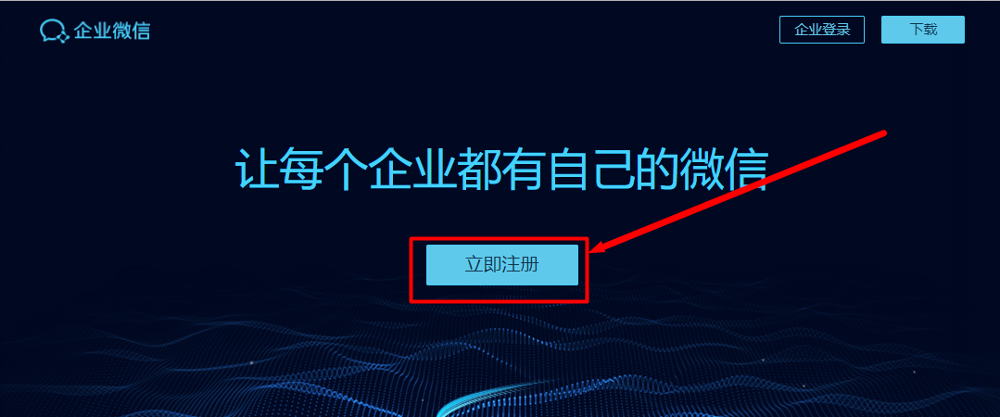

# 企业微信开发环境搭建

[toc]

## 一、企业微信注册与配置

### 1.注册企业微信

（1）登录企业微信网站

> https://work.weixin.qq.com/

访问企业微信网站，点击“立即注册”





（2）填写注册信息

填写注册信息，使用管理员姓名和收集进行注册，并扫描二维码。

勾选同意遵守，点击《注册》按钮，创建成功。


### 2. 登录管理页面

>  https://work.weixin.qq.com/


(1) 点击 "企业登录" 按钮


使用管理员微信扫描二维码，并确认进入管理页面


### 3.组织架构管理

#### 2.1 新增组织架构

- 微信只支持树状组织架构，所有的组织架构中的公司、部门概念在微信中都是部门。

- 根路径是我们申请企业微信时定义的公司名称。

- 微信内的组织架构仅供存放人员使用，与审批流程无关。


（1）点击《通讯录》标签页，进入通讯录后，点击搜索栏边的+按钮，选择添加部门

（2）填写需要新增的部门名称，并选择所归属的上级部门

（3）新增成功


#### 2.2 新增人员

通讯录 -> 添加成员 -> 填写员工信息 -> 保存


> - `账号`字段为费控系统内的员工用户名。该字段新增完成后不可修改，只能删除员工重新创建进行修改。
>
> - `手机`字段或`邮箱`必输，管路员可以通过手机或者邮件邀请员工加入企业。建议使用手机号。
> - `部门`字段选择组织架构中该员工的主岗位。


点击《保存》或者《保存并继续添加》，完成当前员工的新增。


### 4.应用管理

#### 4.1 创建应用

（1）进入管理页面后依次点击：`应用管理` -> `应用` -> `自建`-> `创建应用`，然后填写创建应用的表单，即可创建应用

（2）启用应用，启用应用后，就可以在企业微信中看到此应用了

（3）设置应用的可见范围

（4）设置应用的管理员


## 二、开发工具安装


### 1.开发工具安装

#### 1.1 安装Java

参考：[Java_01_Jdk安装及环境变量配置](https://www.github.com/shirayner/java-knowledge-hierarchy/tree/master/doc%2FJava-Basic%2FJava_01_Jdk%E5%AE%89%E8%A3%85%E5%8F%8A%E7%8E%AF%E5%A2%83%E5%8F%98%E9%87%8F%E9%85%8D%E7%BD%AE.md)


同时，还需要替换JCE策略文件，参见：[Java企业微信开发_Exception_02_java.security.InvalidKeyException: Illegal key size](https://www.cnblogs.com/shirui/p/7411735.html)


#### 1.2 安装Idea

参考：[Idea教程](https://www.github.com/shirayner/java-knowledge-hierarchy/tree/master/doc%2FIdea)


### 2.导入项目到Idea

（1）克隆项目到本地

```bash
git clone git@github.com:shirayner/weixin-service.git
```


（2）导入项目到Idea

直接依次点击 `File` -> `Open...` -> 选择项目直接导入即可


### 3.修改配置

```properties
#企业微信配置
weixin:
    qy:
       corpId: ww92f5da92bb24696e  #企业ID
       contactsSecret: 1m_9XP62YrXjSiYtL5Thba7DRUarqaExKfr_5eAL09w  #通讯录秘钥
       agent:
        - agentId: 1000002  #应用ID
          agentSecret: I73733veH3uCs6H_ijPvIjYD4Rese5UlbYhhQOEE1-I  #应用秘钥
          token: ray             #接收消息服务器配置-Token
          encodingAesKey: z2W9lyOAR1XjY8mopEmiSqib0TlBZzCFiCLp6IdS2Iv   #接收消息服务器配置-EncodingAESKey
          state: ray   # 任意定义
        - agentId: 1000003  # 如果有多个应用就配置多个
          agentSecret: gcGhoOnBWOsyN0mz1TrcUQmO7X71YSv4Ma_TW0F9ilM
          token: weixin
          encodingAesKey: YVbcm1g1ynErRKLeugtsr88VlK7ukpkPZHQJICz6SFQ
          state: hecGroup
```


| 配置属性       | 描述                                                         |
| -------------- | ------------------------------------------------------------ |
| corpId         | 企业ID                                                       |
| contactsSecret | 通讯录秘钥，访问通讯录相关API时需要                          |
| agentId        | 应用ID                                                       |
| agentSecret    | 应用秘钥                                                     |
| token          | 微信加密使用的token字段，可在企业微信管理后台随机生成        |
| encodingAesKey | 微信加密传输的密钥字段，43位长，可在企业微信管理后台随机生成 |
| state          | 可任意指定                                                   |
|                |                                                              |


如何找到上述配置参数？

进入企业微信管理后端

（1）找到corpId


